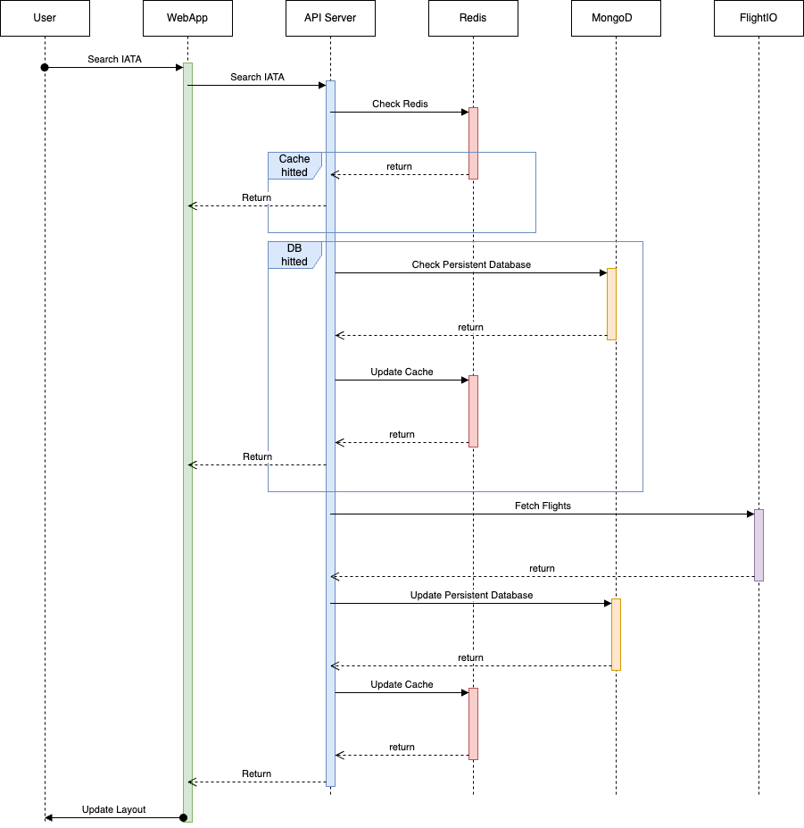

# Glacis Demo
## *SCOPE: 3 hours 30 minutes*

## Some Attributes
- **HEAVY READ**, **LOW LATENCY**, the data should be returned as soon as possible
- **LOW WRITE**, Flight data shouldn't change frequently
- **Cost on Request**, the request should be minimized
- **Over 1200 internaltional airports in the world**, each of them will has daily data -> ~ 50.000 requests per month

## Tech Stack
- Frontend: ReactJS, `/ui/` 
- Backend: FastAPI, `/api_server/`
- Cache Layer: Redis
- Database: MongoDB

## How to run in Dev Environment:
1. Update the FlightIO API key in `api_server/builder/.env`
2. Dev environment: `bash ./run_dev.sh`

## Architecture Overview
The system implements a caching strategy with Redis to optimize data retrieval and minimize external API calls to Flightio.

## Open Items and Known Issues

### 1. Data Pipeline Implementation
- Need to implement automated data loading every 30 minutes
- Split timezone into 48 segments for better cache management
- Ensure users read from cache to improve response time

### 2. Race Condition in Resource Requests
- Multiple users requesting the same non-cached resource simultaneously
- Results in duplicate API calls to Flightio
- Increases operational costs

### 3. Performance Optimization
- Rate limiter to control API requests
- CDN caching implementation
- At the 0:00 of each timezone, update the cache by calling FlightIO API -> Need to consider

### 4. List all airports to have a check locally before sending to FlightIO to save cost
- Get all IATA codes to check locally before sending to FlightIO to reduce the number of requests

### 5. Cache CDN
- Implement CDN caching to reduce API calls, the data will not change frequently within a day

### 6. The API
- the 'day' parameter has no impact on the API

## Getting Started
[Add installation and setup instructions here]

## Contributing
[Add contribution guidelines here]

## License
[Add license information here]

